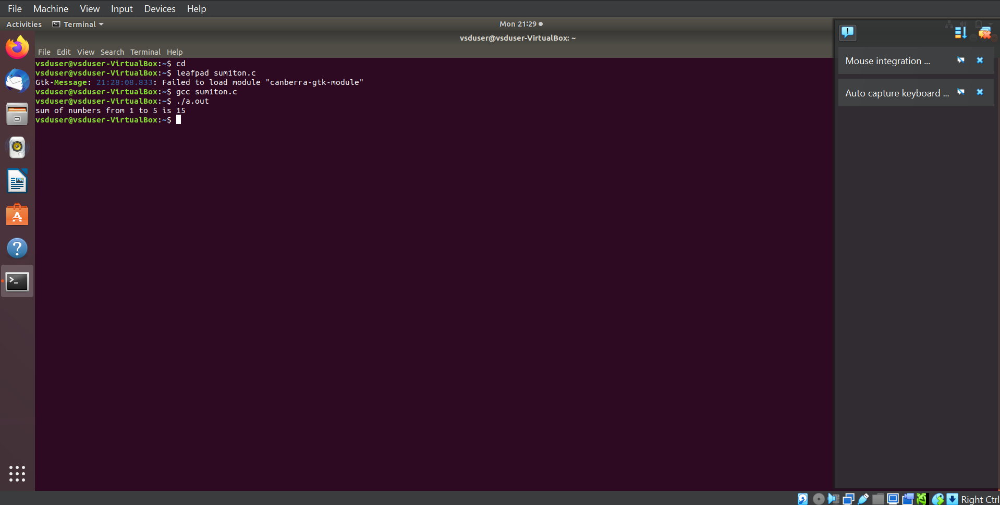
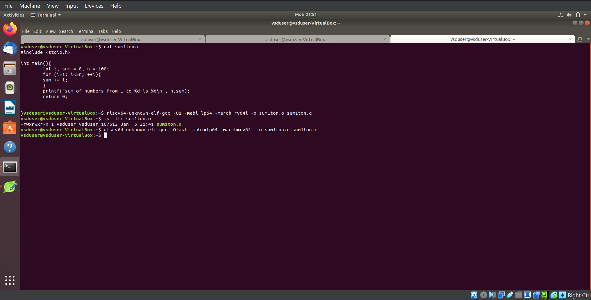
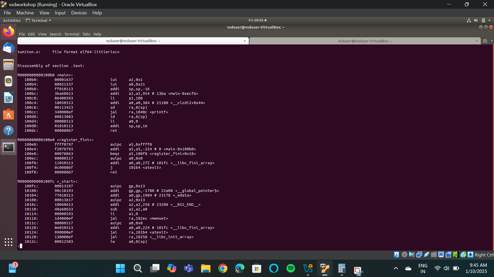

# RISC-V Internship Program powered by SAMSUNG and VSD

This RISC-V Internship using **VSDSquadron Mini** is based on the RISC-V architecture and leverages open-source tools to teach students about VLSI SoC Design and RISC-V. The program is guided by **Kunal Ghosh**, Founder of VSD.

## Basic Details

- **Name**: Gagan H  
- **College**: Sahyadri College of Engineering and Management, Mangaluru 575007  
- **Email**: [gagan.ec22@sahyadri.edu.in](gagan.ec22@sahyadri.edu.in)  
- **GitHub Profile**: [GaganH-Sahyadri-ECE](https://github.com/GaganH-Sahyadri-ECE)  
- **LinkedIn Profile**: [Gagan H](https://www.linkedin.com/in/gagan-h-ba69a9328?utm_source=share&utm_campaign=share_via&utm_content=profile&utm_medium=android_app)  
# Task-1

Task-1: C based lab screenshots

Here are the screenshots for the C-based lab:

  
  
  

Task-1: RISC-V based lab screenshots

Here are the screenshots for the RISC-V based lab:

  
  
  

# Task-2

SKIPE Simulation

Here are the screenshots for the SKIPE Simulation:

  
  

# Task 3: RISC-V Instruction Decoding

This repository contains the completed Task 3 for the RISC-V Internship program, focusing on decoding RISC-V instructions. The task includes analyzing `riscv-objdump` output, identifying 15 unique instructions, and documenting their 32-bit binary instruction formats based on their respective types (R, I, S, B, U, and J).

---

## Task Objectives

1. **Understand RISC-V Instruction Types**  
   Review the RISC-V software documentation to study the following instruction formats:
   - **R-Type:** Register-register operations (e.g., ADD, SUB).
   - **I-Type:** Immediate operations (e.g., LW, JALR).
   - **S-Type:** Store instructions (e.g., SW).
   - **B-Type:** Branch instructions (e.g., BEQ, BNE).
   - **U-Type:** Upper immediate operations (e.g., LUI, AUIPC).
   - **J-Type:** Jump instructions (e.g., JAL).

2. **Identify Unique Instructions**  
   From the `riscv-objdump` output of application code, identify **15 unique instructions**.

3. **Decode Instructions**  
   For each of the identified instructions, determine the **32-bit binary instruction code** in their specific format.

---

## RISC-V Instruction Types

### 1. R-Type Format
R-type instructions perform operations between registers.

