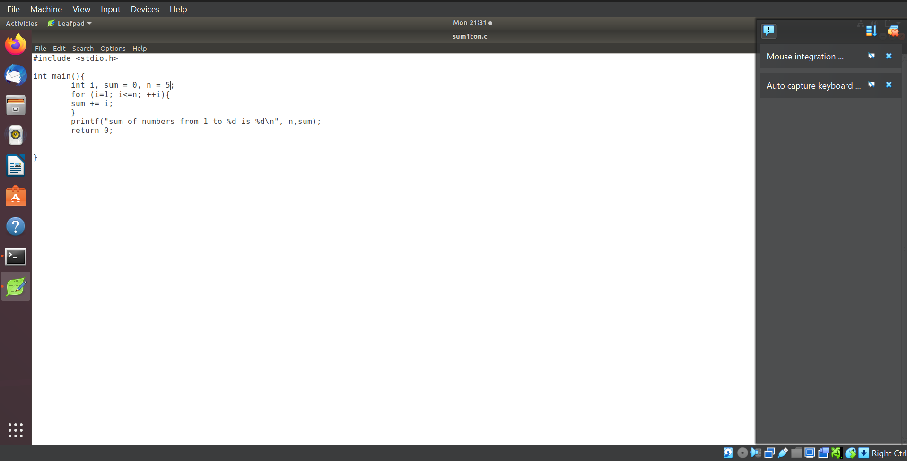
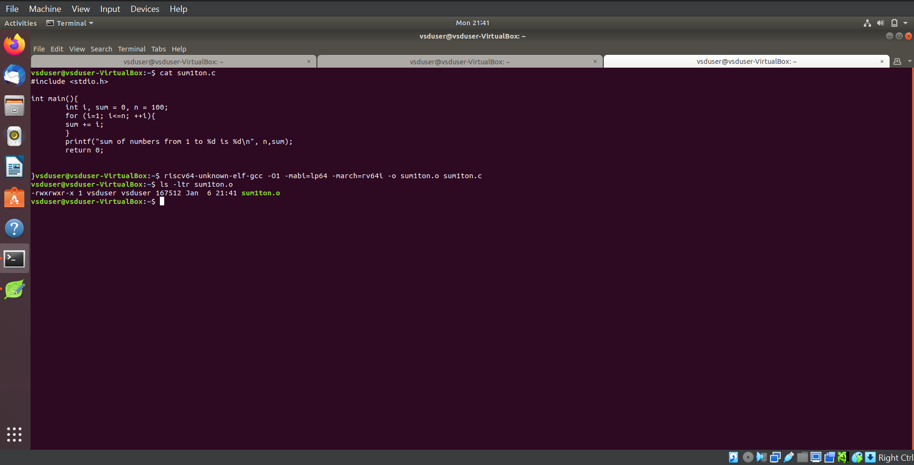
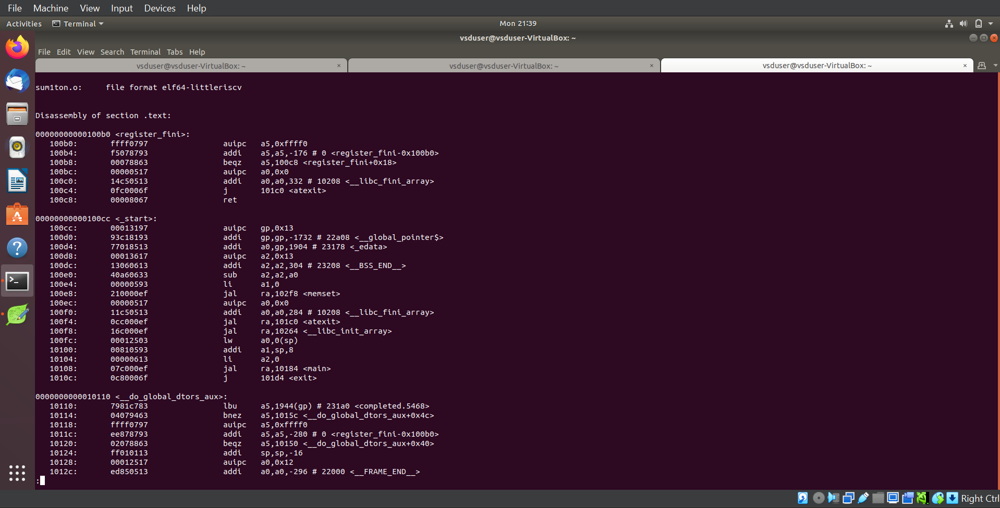
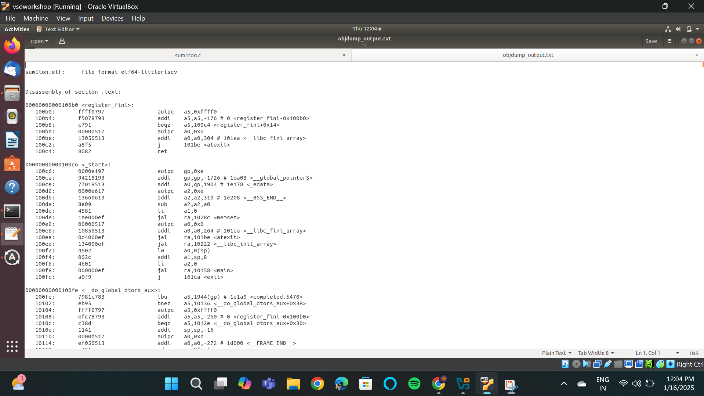

# RISC-V Internship Program powered by SAMSUNG and VSD

This RISC-V Internship using **VSDSquadron Mini** is based on the RISC-V architecture and leverages open-source tools to teach students about VLSI SoC Design and RISC-V. The program is guided by **Kunal Ghosh**, Founder of VSD.

## Basic Details

- **Name**: Gagan H  
- **College**: Sahyadri College of Engineering and Management, Mangaluru 575007  
- **Email**: [gagan.ec22@sahyadri.edu.in](gagan.ec22@sahyadri.edu.in)  
- **GitHub Profile**: [GaganH-Sahyadri-ECE](https://github.com/GaganH-Sahyadri-ECE)  
- **LinkedIn Profile**: [Gagan H](https://www.linkedin.com/in/gagan-h-ba69a9328?utm_source=share&utm_campaign=share_via&utm_content=profile&utm_medium=android_app)  
# Task-1

<details>
<summary>Task-1: C based lab screenshots</summary>

Here are the screenshots for the C-based lab:

  
  
  

</details>

<details>
<summary>Task-1: RISC-V based lab screenshots</summary>

Here are the screenshots for the RISC-V based lab:

  
  
  

</details>

# Task-2
<details>
<summary>SKIPE Simulation</summary>

Here are the screenshots for the SKIPE Simulation:

  
  

</details>

# Task 3
<details>
 <summary> RISC-V Instruction Decoding</summary>

Task 3 for the RISC-V Internship program, focusing on decoding RISC-V instructions. The task includes analyzing `riscv-objdump` output, identifying 15 unique instructions, and documenting their 32-bit binary instruction formats based on their respective types (R, I, S, B, U, and J).

---

## Task Objectives

1. **Understand RISC-V Instruction Types**  
   Review the RISC-V software documentation to study the following instruction formats:
   - **R-Type:** Register-register operations (e.g., ADD, SUB).
   - **I-Type:** Immediate operations (e.g., LW, JALR).
   - **S-Type:** Store instructions (e.g., SW).
   - **B-Type:** Branch instructions (e.g., BEQ, BNE).
   - **U-Type:** Upper immediate operations (e.g., LUI, AUIPC).
   - **J-Type:** Jump instructions (e.g., JAL).

2. **Identify Unique Instructions**  
   From the `riscv-objdump` output of application code, identify **15 unique instructions**.

3. **Decode Instructions**  
   For each of the identified instructions, determine the **32-bit binary instruction code** in their specific format.

---

## RISC-V Instruction Types

### 1. R-Type Format
R-type instructions perform operations between registers.
Example: `ADD` (x1 = x2 + x3)

### 2. I-Type Format
I-type instructions involve immediate values.
Example: `LW` (x4 = MEM[x5 + imm])

### 3. S-Type Format
S-type instructions are used for memory store operations.
Example: `SW` (MEM[x5 + imm] = x4)

### 4. B-Type Format
B-type instructions perform conditional branches.
Example: `BEQ` (if x6 == x7, branch to offset)

### 5. U-Type Format
U-type instructions load or modify upper immediate values.
Example: `LUI` (x1 = imm << 12)

### 6. J-Type Format
J-type instructions are used for jumps.
Example: `JAL` (x1 = PC + 4, PC = PC + offset)

---

## Instruction Decoding Table

The following table provides the 15 unique instructions, their types, and their 32-bit binary representations:

| **Instruction** | **Type**   | **Binary Pattern**               | **Explanation**                                   |
|------------------|------------|-----------------------------------|---------------------------------------------------|
| ADD              | R-Type     | `0000000 00010 00011 000 00100 0110011` | Adds values in registers x2 and x3, stores in x4. |
| SUB              | R-Type     | `0100000 00010 00011 000 00100 0110011` | Subtracts x3 from x2, stores in x4.              |
| LW               | I-Type     | `0000000 00010 00100 010 00001 0000011` | Loads a word from memory address into x1.         |
| SW               | S-Type     | `0000000 00101 00100 010 00001 0100011` | Stores word from x1 to memory at x5 + offset.    |
| BEQ              | B-Type     | `0000000 00110 00111 000 01000 1100011` | Branches if x6 equals x7.                        |
| BNE              | B-Type     | `0000000 00110 00111 001 01000 1100011` | Branches if x6 does not equal x7.               |
| JAL              | J-Type     | `0000000 00000 00101 000 00010 1101111` | Jumps to label, stores return address in x5.     |
| JALR             | I-Type     | `0000000 00001 00100 000 00000 1100111` | Jumps to address in x4 + imm, stores PC+4 in x1. |
| LUI              | U-Type     | `0000000 00000 00100 000 00000 0110111` | Loads upper immediate value to x4.              |
| AUIPC            | U-Type     | `0000000 00000 00100 000 00000 0010111` | Adds upper immediate value to PC, stores in x4. |
| NOP              | I-Type     | `0000000 00000 00000 000 00000 0000001` | No operation.                                    |
| AND              | R-Type     | `0000000 00010 00011 111 00100 0110011` | Logical AND of x2 and x3, result in x4.          |
| OR               | R-Type     | `0000000 00010 00011 110 00100 0110011` | Logical OR of x2 and x3, result in x4.           |
| XOR              | R-Type     | `0000000 00010 00011 100 00100 0110011` | Logical XOR of x2 and x3, result in x4.          |
| SLT              | R-Type     | `0000000 00010 00011 010 00100 0110011` | Sets x4 to 1 if x2 < x3.                         |

---

## Conclusion

In Task 3 of the RISC-V Internship program, the focus was on understanding and decoding various RISC-V instruction formats (R, I, S, B, U, and J). By analyzing the `riscv-objdump` output, we identified 15 unique instructions and provided their corresponding 32-bit binary representations. This task enhanced our understanding of RISC-V instruction formats and how they are encoded in machine language, helping in building a strong foundation for low-level programming and system design.

---
Here are the screenshots for the RISC-V Instruction Decoding:


 
 
 
 ---

## How to Run

### Steps to Analyze and Decode Instructions

1. **Setup RISC-V Toolchain**
   - Install RISC-V GCC and associated tools:
     ```bash
     sudo apt update
     sudo apt install gcc-riscv64-linux-gnu gdb-multiarch
     ```

2. **Generate `riscv-objdump` Output**
   - Compile application code to create an ELF file:
     ```bash
     riscv64-unknown-elf-gcc -o application.elf application.c
     ```
   - Generate the assembly dump:
     ```bash
     riscv64-unknown-elf-objdump -d application.elf > objdump_output.txt
     ```

3. **Decode Instructions**
   - Use the RISC-V manual to decode instructions from the dump.

---
</details>


# Task 4
<details>
 <summary> Functional Simulation of RISC-V Core</summary>

# Steps to Perform Functional Simulation of RISC-V Core

## Step 1: Create a New Directory

1. Open your terminal.
2. Create a directory with your name by entering the following command:
   ```bash
   mkdir <your_name>
   ```

## Step 2: Create Verilog and Testbench Files

1. Navigate to the newly created directory:
   ```bash
   cd <your_name>
   ```
2. Create two files using the `touch` command:
   ```bash
   touch <your_name>_rv32i.v <your_name>_rv32i_tb.v
   ```

## Step 3: Add Code to the Files

1. Open the files `<your_name>_rv32i.v` and `<your_name>_rv32i_tb.v` in a text editor of your choice (e.g., `nano`, `vim`, or a GUI-based editor).
2. Copy the reference code from the provided GitHub repository.
3. Paste the code into the respective files and save them.

## Step 4: Run and Simulate the Verilog Code

1. Use the `iverilog` tool to compile the Verilog files:
   ```bash
   iverilog -o <your_name>_rv32i <your_name>_rv32i.v <your_name>_rv32i_tb.v
   ```
2. Execute the compiled file:
   ```bash
   ./<your_name>_rv32i
   ```

## Step 5: View the Simulation Waveform

1. Open GTKWave to view the simulation waveform:
   ```bash
   gtkwave <your_name>_rv32i.vcd
   ```
2. The GTKWave interface will appear, allowing you to analyze the waveform results.

---

## Task 4: Functional Simulation of RISC-V Core

### Task Objectives

1. **Understand the Simulation Environment**  
   Familiarize yourself with the functional simulation setup for the RISC-V Core.

2. **Perform Simulation**  
   Execute functional simulations of the RISC-V Core using the Verilog netlist and testbench provided.

3. **Capture and Analyze Waveforms**  
   Use GTKWave to visualize and analyze the simulation results.

---

### Steps for Task 4

1. **Set Up the Environment**  
   - Clone the repository containing the Verilog netlist and testbench for the RISC-V Core:
     ```bash
     git clone <repository_link>
     ```
   - Navigate to the cloned directory:
     ```bash
     cd <repository_directory>
     ```

2. **Compile the Files**  
   Use the `iverilog` tool to compile the Verilog netlist and testbench:
   ```bash
   iverilog -o riscv_core_sim riscv_core.v riscv_core_tb.v
   ```

3. **Run the Simulation**  
   Execute the compiled simulation:
   ```bash
   ./riscv_core_sim
   ```

4. **View the Simulation Results**  
   - Open GTKWave to load the waveform file generated by the simulation:
     ```bash
     gtkwave riscv_core.vcd
     ```
   - Analyze the waveforms to validate the core functionality.

5. **Document Results**  
   - Capture screenshots of the simulation waveforms.
   - Save and organize the waveform images for reporting.

---

### RISC-V Core Simulation Details

1. **Core Features**  
   The RISC-V Core includes instruction decoding, ALU operations, register file handling, and control signal generation.

2. **Simulation Scenarios**  
   - Verify basic RISC-V instructions (e.g., ADD, SUB, LW, SW).
   - Test conditional branches (e.g., BEQ, BNE).
   - Simulate jumps (e.g., JAL, JALR).

3. **Expected Outcomes**  
   - Functional correctness of the RISC-V Core.
   - Accurate waveform visualization for key signals (e.g., PC, registers, memory).

---

### Conclusion

In Task 4 of the RISC-V Internship program, the focus was on simulating the functional behavior of a RISC-V Core. By running Verilog simulations, analyzing waveforms, and documenting results, this task provided hands-on experience with hardware design and verification tools, building a solid foundation for advanced projects in VLSI and RISC-V development.

---

## README

### Functional Simulation of RISC-V Core

This repository contains the resources and instructions for performing the functional simulation of a RISC-V Core as part of Task 4 of the RISC-V Internship program.

---

### Directory Structure

```plaintext
<repository_directory>/
├── riscv_core.v         # Verilog file for the RISC-V Core
├── riscv_core_tb.v      # Testbench for the RISC-V Core
├── results/             # Directory for storing simulation waveforms
├── README.md            # Documentation file
```

---

### Prerequisites

1. **Tools Required**  
   - `iverilog`: Verilog simulation tool
   - `gtkwave`: Waveform viewer

2. **Setup**  
   Ensure `iverilog` and `gtkwave` are installed on your system. Use the following commands to install them (Ubuntu/Debian):
   ```bash
   sudo apt update
   sudo apt install iverilog gtkwave
   ```

---

### How to Run

1. **Clone the Repository**
   ```bash
   git clone <repository_link>
   cd <repository_directory>
   ```

2. **Compile the Files**
   ```bash
   iverilog -o riscv_core_sim riscv_core.v riscv_core_tb.v
   ```

3. **Run the Simulation**
   ```bash
   ./riscv_core_sim
   ```

4. **View Waveforms**
   ```bash
   gtkwave riscv_core.vcd
   ```

---
</details>


