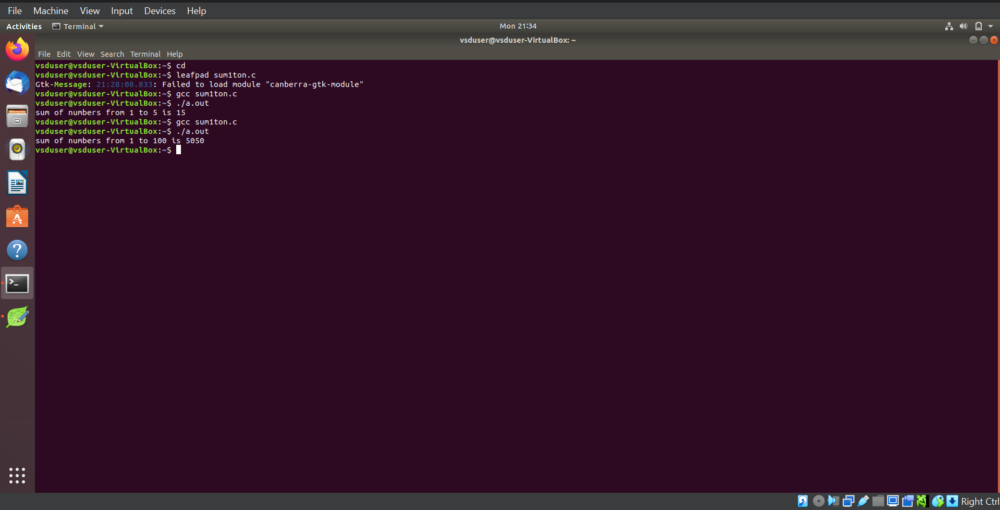

# RISC-V Internship Program powered by SAMSUNG and VSD

This RISC-V Internship using **VSDSquadron Mini** is based on the RISC-V architecture and leverages open-source tools to teach students about VLSI SoC Design and RISC-V. The program is guided by **Kunal Ghosh**, Founder of VSD.

## Basic Details

- **Name**: Gagan H  
- **College**: Sahyadri College of Engineering and Management, Mangaluru 575007  
- **Email**: [gagan.ec22@sahyadri.edu.in](gagan.ec22@sahyadri.edu.in)  
- **GitHub Profile**: [GaganH-Sahyadri-ECE](https://github.com/GaganH-Sahyadri-ECE)  
- **LinkedIn Profile**: [Gagan H](https://www.linkedin.com/in/gagan-h-ba69a9328?utm_source=share&utm_campaign=share_via&utm_content=profile&utm_medium=android_app)  
# Task-1:

## C-Based Lab Screenshots

## RISC-V Based Lab Screenshots

## RISC-V Based Lab Screenshots

